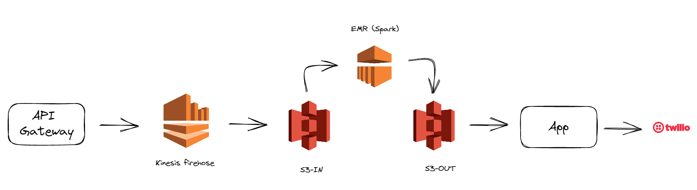

# Proposta de arquitetura

# Premissas

- A Api Gateway no início do pipeline receberia as requisições (posts) dos clientes e mandaria para o Kinesis
- Os dados possuem o mesmo contrato, diferenciando - se em seus valores internamente
- Como a Mercafácil possui clientes primáriamente como supermercados, sua atividade de lançamento de dados baseia - se geralmente entre 7:00 até 23:00.
- Há apenas um modelo de machine learning ja treinado rodando.
- Os dados não serão tratados por ETL e sim sob demanda quando o modelo rodar (Tratar: Casting de colunas, agregações e etc)

# Detalhamento da Arquitetura

## Camada de Ingestão
Nessa camada, podemos usar o kinesis firehose para coletar os dados vindos da API. O firehose possui a vantagem de ser serverless e auto-escalável, fazendo com que não precisemos nos preocupar com infraestrutura. Além de receber os dados, o firehose faria as seguintes atribuições:

- Particionaria os dados de acordo com a granularidade de timestamp do evento desejado e do tipo de evento
- Transformaria os dados em parquet
- Carregaria os dados em um bucket no S3

Isso faz com que possamos categorizar melhor os dados com o particionamento e também diminuiria o tamanho do armazenamento dado a compressão dos arquivos em parquet.

## Camada de Armazenamento (IN)
Aqui os dados seriam acomodados pelo bucket no S3 com o seguinte formato de exemplo

data/
---- yyyy-mm-dd HH:MM:00/
-------- Evento_1
-------- Evento_2
-------- Evento_3
-------- Evento_4
---- yyyy-mm-dd HH:MM:01/
-------- Evento_1
-------- Evento_2
-------- Evento_3
-------- Evento_4

Esse particionamento poderia mudar de acordo com alguma regra de negócio que pudesse incluir por exemplo a região geográfica, a rede de supermercados ou até o próprio cliente.

## Camada de Machine Learning (EMR)
Esta seria responsável pela aplicacção do modelo de machine learning para recomendação de produtos a serem ofertados de acordo com a regra D -n (n: Granularidade de tempo). Poderíamos configurar uma DAG no Airflow no após o horario de funciomento dos mercados com a seguintes tarefas

Subir_Cluster_EMR >> Processar_Dados_Usando_ML_Spark >> Gravar_Resultados_No_S3_Out >> Excluir_Cluster_EMR

Esse processo teria entre 23:00 e 07:00 do dia seguinte para rodar.Os dados devem ser particionados de acordo com o dia, tendo nele um dado com a composição de ofertas.

## Camada de Armazenamento (OUT)
Um bucket iria armazenar os dados resultantes do modelo com a seguinte estrutura:

data_output/
    yyyy-mm-01/
            recomendations_uuid.txt
    yyyy-mm-02/
            recomendations_uuid.txt
    yyyy-mm-03/
            recomendations_uuid.txt
    yyyy-mm-04/
            recomendations_uuid.txt
        
## Camada de envio para os cliente
Alguma aplicação iria ler os dados desse bucket e enviaria a partir da API do Twillo as recomendações para os clientes

# Considerações

## Se caso tiver mais de um tipo de contrato
Caso os dados mandados pela API Gateway tiverem mais de 1 tipo de contrato com chaves diferentes, precisaremos criar um sistema de entrega para cada tipo de chave. Por exemplo:

Contrato1: {
    'timestamp': zzzz,
    'cupom': xxxx
}

Contrato2: {
    'timestamp': zzzz,
    'novo_operador': yyyy
}

Ainda poderiamos ter uma mesma partição por timestamp, mas configurariamos caminhos diferentes para cada sistema de entrega:

path_contrato_1: data/timestamp/cupom/xxxx_1 
path_contrato_2: data/timestamp/novo_operador/yyyy_1

## Caso de latência na entrega do dado pela API
Imagine que algum cliente teve problemas para mandar o dado (falta de internet, erro no sistema de envio) e esse intervalo for maior que o intervalo de entrada do modelo (D -n). Como um dos parâmetros do modelo é o tempo, isso pode afetar seu desempenho. Logo isso terá que ser tratado no pré processamento dos dados no EMR

# Adições futuras

## Modelos em Real-Time
Caso precisemos de recomendações em tempo real, poderiamos subir o kinesis data stream entre a API e o Firehose, fazendo com que possamos divir o trabalho para camada rápida e para a camada lenta. Um modelo usando EMR e spark streaming fazendo inferênias em tempo real e outra com o kinesis armenando no S3

